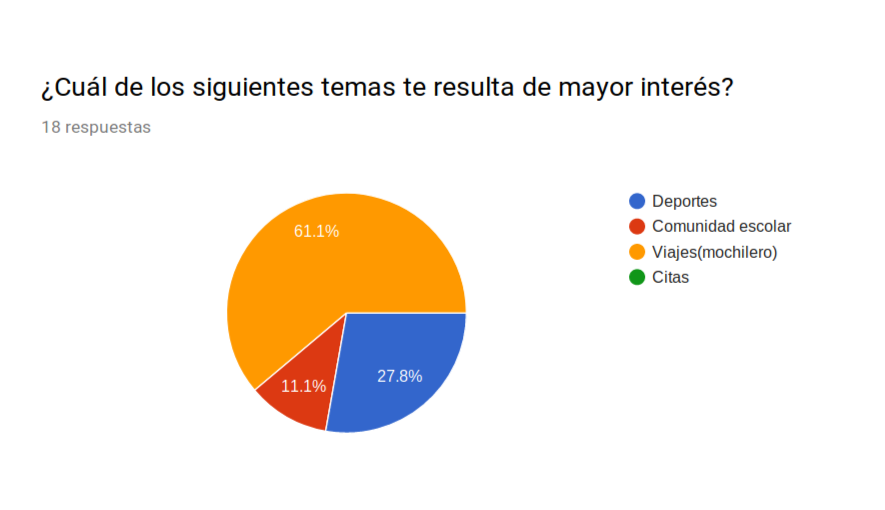
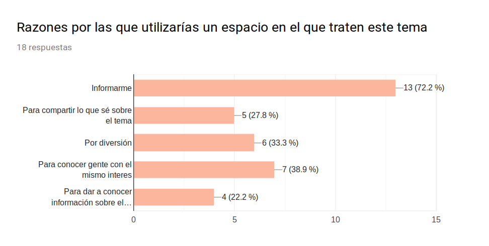
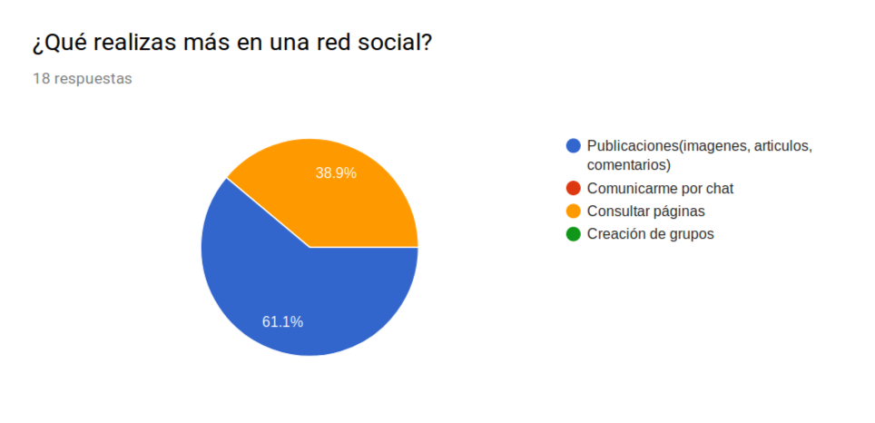
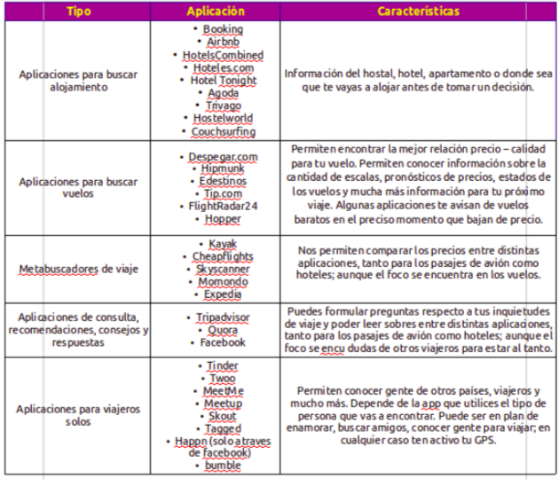
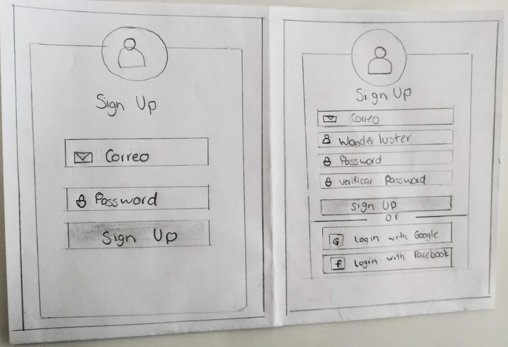
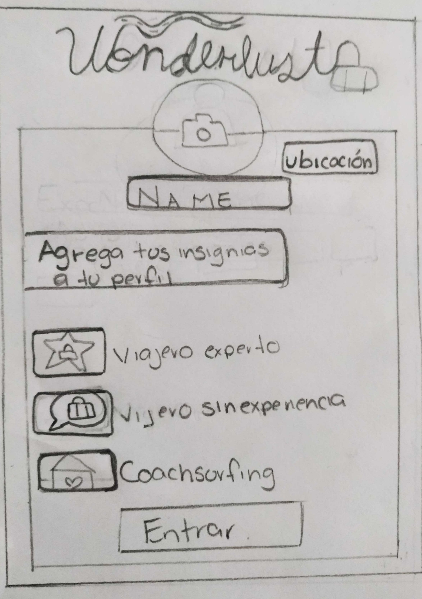
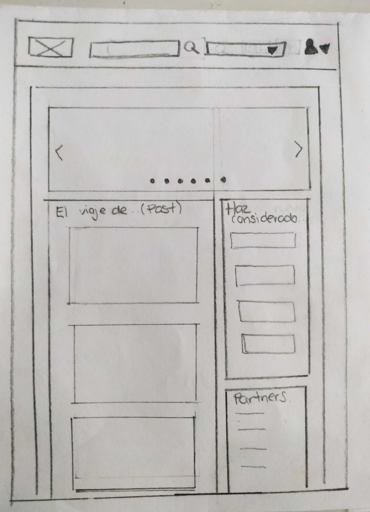

# Creando una Red Social
##DECISIÓN DE PROYECTO
  Para tomar una decisión sobre el proyecto de Red Social, decidimos seleccionar varios temas y realizar una encuesta para tener claro el tema y lo que el usuario busca en una Red Social . Este es el análisis de la encuesta. 
  La mayoría de nuestros usuarios tiene una edad de entre 19 y 25 años .
  Entre los temas que sugerimos fueron:
          *Deportes
          *Comunidad escolar
          *Viajes(mochilero)
          *Citas
  Donde más del 60% escogió viajero(mochilero).
  

En la pregunta donde seleccionaron las razones por las que utilizarías un espacio en el que traten el tema que seleccionaron, más del 70% seleccionó lo utilizarían para informarse, seguido de para conocer a gente con el mismo interés con un 38%.

Cuando preguntamos ¿Qué realizas más en una red social?, más del 60% escogió Publicaciones(imágenes, artículos,comentarios), lo cual se pretende agregar estas acciones. 

También preguntamos sobre las razones por las que dejan de frecuentar alguna red social y un 44% escogió que contienen demasiada información innecesaria o ajena a su interés seguido con un 38% que es aburrido.

##INVESTIGACIÓN 
Realizamos una investigación primero sobre los temas que nos interesaban para realizar nuestra encuesta. Una vez que tomamos la decisión sobre el tema de nuestra Red Social decidimos investigar sobre cómo queríamos que se llamara nuestra Red Social y encontramos esta información: 
La etimología de wanderlust nos lleva hasta la lengua germana. Wandern significa “vagar”, mientras que lust lo traducimos como “pasión”. En término anglosajón wanderlust es lo mismo: pasión por viajar.

Somos almas inquietas que siempre están pensando a dónde ir, cuándo será el próximo viaje, qué sitios nuevos conocerán y qué aventuras se encontrarán por el camino. 

Viajar es bueno para la mente. Te abre las puertas del conocimiento y nuevas culturas, mantiene el cerebro activo, mejora tu orientación y tus habilidades para comunicarte con personas que no hablan tu idioma. Viajar no es solo explorar nuevas ciudades, sino que también implica llegar a sitios incógnitos, poco poblados. Viajar es adentrarse en aventuras y retos que jamás te habrías propuesto, como saltar en paracaídas en una ciudad desconocida o bucear por arrecifes únicos en el mundo. Viajar es llevar tus propios límites a lugares inimaginables.

Definicion del producto
Wanderlust te permite estar en contacto con wanderlusters que comparten sus experiencias de viaje. Podrás consultar y compartir información, pedir recomendaciones, tener notificaciones acerca de vuelos, hospedajes y muchas más información.

##INVESTIGACIÓN 
Realizamos una investigación primero sobre los temas que nos interesaban para realizar nuestra encuesta. Una vez que tomamos la decisión sobre el tema de nuestra Red Social decidimos investigar sobre cómo queríamos que se llamara nuestra Red Social y encontramos esta información: 
    *Trip Advisor:es la opción más popular y más sencilla de planificar tu viaje. Ofrece consejos de otros viajeros, una amplia variedad de opciones de viaje y funciones de planificación que te permiten buscar los mejores hoteles y precios de alojamiento. Además, el servicio permite identificar los establecimientos que han sido respaldados y recomendados por las opiniones de los usuarios para que más personas puedan seguir asistiendo a ellos con la seguridad de que encontrarán un buen servicio.
    *Airbnb:Quizás uno de los aspectos que más gasto genera cuando viajamos es el alojamiento. Y si el alojamiento es el problema, Airbnb es la solución. La comunidad de usuarios inscritos en esta plataforma se convierten en anfitriones que ofrecen alojamiento para viajeros. Entre los anuncios que se publican pueden encontrarse casas completas o habitaciones privadas y compartidas, con una amplia variedad de precios en función del espacio ofrecido. Además los usuarios que ya se han alojado en un sitio pueden dejar comentarios para los futuros huéspedes, creando un círculo de confianza y seguridad.
    *Foursquare: es una red social que seguro ya conoces y hasta utilizas, pero en cuestión de viajes puede ser de mucha utilidad para descubrir o evitar lugares, hoteles, restaurantes, platillos, o para seguir alguno que otro consejo que los usuarios han dejado, sus funcionalidades son muchísimas y con el nuevo rediseño de su interfaz todo es más sencillo de utilizar. Además puede ser una alternativa muy interesante para dejar rastro del recorrido que haz realizado durante tu viaje y de lo que te han parecido los lugares que has visitado.
    *Trover:nació a partir de la dificultad que encontraron sus creadores —viajeros también— para capturar y compartir las historias y aventuras que se encontraban en sus viajes. Así que decidieron crear una red a manera de galería de fotos y/o guía turística que permitiera compartir sus experiencias y conectar con otras personas con los mismos intereses. Trover es como un Pinterest de los viajes. En él podrás encontrar inspiración e inspirar a otras personas para descubrir nuevos lugares.
Nuestra competencia trata de cubrir una necesidad que todo viajero busca. Pero no todas han cumplido con estas preferencias por eso , con base a nuestra investigación pretendemos tomar los puntos más importantes de los usuarios y los algunas ideas de nuestra competencia para formar una Red Social fuerte que apoye a los viajeros pero, lo más importante  que logre unirlos a pesar de las distancias.

##ANÁLISIS DE NUESTRA COMPETENCIA

##OBJETIVO DEL PROYECTO
Construir una Red Social para viajeros. Nuestra Red Social tendrá que permitir a cualquier usuario crear una cuenta de acceso y loguearse con ella; crear, editar, borrar y "likear" publicaciones. El objetivo principal de aprendizaje de este proyecto es construir una Single-page Application (SPA), responsive (con más de una vista / página) en la que podamos leer y escribir datos.
##USER PERSONA

##HISTORIA DE USUARIO
      *Usuario nuevo se loguea con: correo, nombre contraseña y verifica su contraseña.
      *Nuestro usuario nuevo se loguea con gmail.
      *Nuestro usuario nuevo después de loguearse llena los datos básicos de su perfil.
      *Nuestro usuario registrado ingresa a su cuenta con usuario y contraseña
      *Nuestro usuario registrado  edita su perfil con nuevos campos (fotos, reseñas, contenido de información básica)
      *Nuestro usuario registrado publica fotos e historia de sus viajes
      *Nuestro usuario registrado filtra por experto para más información sobre viajes que tienen 
      usuarios expertos
      *Nuestro usuario registrado decide cambiar su estado a (compartir casa) y llena los campos de registro con sus documentos. 

##STORYLINE 

##PROTOTIPO
    Prototipo de baja fidelidad

[Prototipo Marvel](https://marvelapp.com/c8gc340)

  Prototipo de alta fidelidad  

## Índice

* [1. Preámbulo](#1-preámbulo)
* [2. Resumen del proyecto](#2-resumen-del-proyecto)
* [3. Objetivos de aprendizaje](#3-objetivos-de-aprendizaje)
* [4. Consideraciones generales](#4-consideraciones-generales)
* [5. Criterios de aceptación mínimos del proyecto](#5-criterios-de-aceptación-mínimos-del-proyecto)
* [6. Hacker edition](#6-hacker-edition)
* [7. Entrega](#7-entrega)
* [8. Evaluación](#8-evaluación)
* [9. Pistas, tips y lecturas complementarias](#9-pistas-tips-y-lecturas-complementarias)

***

## 1. Preámbulo

Instagram, Snapchat, Twitter, Facebook, Twitch, Linkedin, etc. Las redes
sociales han invadido nuestras vidas. Las amamos u odiamos, y muchos no podemos
vivir sin ellas.

Hay redes sociales de todo tipo y para todo tipo de intereses. Por ejemplo,
en una ronda de financiamiento con inversionistas, se presentó una red social
para químicos en la que los usuarios podían publicar artículos sobre sus
investigaciones, comentar en los artículos de sus colegas, y filtrar artículos
de acuerdo a determinadas etiquetas o su popularidad, lo más reciente, o lo
más comentado.

## 2. Resumen del proyecto

En este proyecto construirás una Red Social sobre lo que decidan tú y tu equipo.
Podría ser, por ejemplo, sobre alimentación saludable, feminismo, educación,
salud, energías renovables, amantes de los [Tacos de Canasta](https://es.wikipedia.org/wiki/Taco), o de lo que sea.

Tu Red Social tendrá que permitir a cualquier usuario crear una cuenta de
acceso y loguearse con ella; crear, editar, borrar y _"likear"_ publicacciones.

## 3. Objetivos de aprendizaje

El objetivo principal de aprendizaje de este proyecto es construir una
**[Single-page Application (SPA)](https://es.wikipedia.org/wiki/Single-page_application), 
[_responsive_](https://github.com/Laboratoria/curricula-js/tree/master/topics/css/02-responsive)**
 (con más de una vista / página) en la que podamos **leer y escribir datos.**

## 4. Consideraciones generales

* Este proyecto se debe trabajar en equipos de tres.

* La lógica del proyecto debe estar implementada completamente en JavaScript
  (ES6+), HTML y CSS :smiley:. Para este proyecto **no está permitido** utilizar
  _frameworks_ o librerías de CSS y JS.

* La división y organización del trabajo debe permitir, sin excepciones, que
  **cada integrante** del equipo practique el aprendizaje de todo lo involucrado
  en **cada historia**. _Eviten dividirse el trabajo como en una fábrica._
  - ¿Sientes hasta momento que has avanzado en tus proyectos con cierta fluidez 
    y sin mayores  problemas? Sé generosa con tus compañeras, permíteles aprender
    y practicar sin restricciones, aunque tome un poco más de tiempo. Aproveha para
    _coachearlas_, hacer _pair programming_. Una de las mejores maneras de
    aprender es explicando verbalmente lo que has aprendido.

  - ¿Se te está haciendo difícil y te cuesta un poco más avanzar? No te quedes
    con las partes "fáciles" del proyecto, conversa, negocia, exige tu oportunidad
    para practicar y aprender lo que se te hace más difícil.

  - Prioricen el aprendizaje.

* Solamente pueden trabajar en una única historia por vez, no pueden avanzar a
  la siguiente sin haber completado la anterior. La historia se completa cuando
  se cumplen **todos** sus Criterios de Aceptación + **toda** su Definición
  de Terminado.

Para comenzar tendrás que hacer un _fork_ y _clonar_ este repositorio.

## 5. Criterios de aceptación mínimos del proyecto

### 5.1 Boilerplate

Este proyecto no incluye un _boilerplate_, así es que tendrás que definir la
estructura de carpetas y escribir tus propias Pruebas Unitarias (_tests_). Para
hacerlo, puedes guiarte de los proyectos anteriores.

### 5.2 Definición del producto

En el `README.md` cuéntanos brevemente cómo descubriste las necesidades de los
usuarios y cómo llegaste a la definición final de tu producto. Es importante
que detalles:

* Quiénes son los principales usuarios de producto.
* Qué problema resuelve el producto / para qué le servirá a estos usuarios.

### 5.3 Historias de usuario

Una vez que entiendas las necesidades de tus usuarixs, escribe las Historias de
Usuario que representen todo lo que necesitan hacer/ver en la Red Social. Cada
una de tus Historias de Usuario debe tener:

* **Criterios de Aceptación:** todo lo que debe ocurrir para satisfacer las
  necesidades del usuario.

* **Definición de terminado:** todos los aspectos técnicos que deben cumplirse
  para que, como equipo, sepan que esa historia está terminada y lista
  para publicarse. **Todas** tus Historias de Usuario (salvo excepciones), deben
  incluir estos aspectos en su Definición de Terminado (más todo lo que
  necesiten agregar):

  - Debe ser una **SPA**.
  - Debe ser _responsive_.
  - Deben haber recibido _code review_ de al menos una compañera de otro equipo.
  - Hicieron los _test_ unitarios
  - Testearon manualmente buscando errores e imperfecciones simples.
  - Hicieron _pruebas_ de usabilidad e incorporaron el _feedback_ de los
    usuarios como mejoras.
  - Desplegaron su aplicación y etiquetaron la versión (git tag).

* Te dejamos un ejemplo de una historia de Usuario, pero va a depender de lo
  que encuentren durante su investigación.
    

    > Como usuario nuevo debo poder crear una cuenta con email y password para 
    > poder iniciar sesion. Por otro lado, necesito también tener la opción de 
    > iniciar sesión con mi cuenta de Google o Facebook.
    >
    > **Criterios de aceptación**
    > - Si el mail o password no es válido, al momento de logearme, debo poder 
    >   ver un mensaje de error.
    > - Debe ser visible si hay algún mensaje de error.
    > - Debo poder ver esta página de creación en Móviles y desktop (responsive). 
    > - No debe necesitar recargar la página para crear una cuenta (SPA).
    >
    > **Definición de terminado**
    > - La funcionalidad cumple satisface los criterios de aceptación.
    > - La funcionalidad tiene _test unitarios_.
    > - El diseño visual corresponde al prototipo de alta fidelidad.
    > - El código de esta funcionalidad recibió code review.
    > - La funcionalidad esta desplegada y pública para ser probada. 
    > - La funcionalidad fue probada manualmente.
    > - Se hicieron pruebas de usuabilidad y se implementó el feedback si se 
    >   consideró necesario.

### 5.4 Diseño de la Interfaz de Usuario (prototipo de baja fidelidad)

Debes definir cuál será el flujo que seguirá el usuario dentro de tu aplicación
y, con eso, diseña la Interfaz de Usuario (UI por sus siglas en inglés) que
siga este flujo.

### 5.5 Responsive

Debe verse bien en dispositivos de pantallas grandes
(computadoras/es, laptops, etc.) y pequeñas (_tablets_, celulares, etc.). Te
sugerimos seguir la técnica de _`mobile first`_ (más detalles sobre esta técnica
al final).

### 5.6 Consideraciones del comportamiento de la interfaz de usuario (UI)

Estas consideraciones te ayudarán a escribir las Definiciones de Terminado de
tus H.U.:

#### Creación de cuenta de usuario e inicio de sesión

* _Login_ con Firebase:
  - Para el _login_ y las publicaciones en el muro puedes utilizar [Firebase](https://firebase.google.com/products/database/)
  - Creación de cuenta de acceso y autenticación con cuenta de correo y
    contraseña, y también con una cuenta de Google.
* Validaciones:
  - Solamente se permite el acceso a usuarios con cuentas válidas.
  - No pueden haber usuarios repetidos.
  - La cuenta de usuario debe ser un correo electrónico válido.
  - Lo que se escriba en el campo (_input_) de contraseña debe ser secreto.
* Comportamiento:
  - Al enviarse el formulario de registro o inicio de sesión, debe validarse.
  - Si hay errores, se deben mostrar mensajes descriptivos para ayudar al
  usuario a corregirlos.

#### Muro/timeline

* Validaciones:
  - Al publicar, se debe validar que exista contenido en el _input_.
* Comportamiento:
  - Al recargar la aplicación, se debe verificar si el usuario está _logueado_
    antes de mostrar contenido.
  - Poder publicar un _post_.
  - Poder dar y quitar _like_ a una publicación. Máximo uno por usuario.
  - Llevar un conteo de los _likes_.
  - Poder eliminar un post específico.
  - Pedir confirmación antes de eliminar un _post_.
  - Al dar _click_ para editar un _post_, debe cambiar el texto por un _input_
    que permita editar el texto y luego guardar los cambios.
  - Al guardar los cambios debe cambiar de vuelta a un texto normal pero con la
    información editada.
  - Al recargar la página debo de poder ver los textos editados.

### 5.7 Consideraciones técnicas Front-end

* Separar la manipulación del DOM de la lógica (Separación de responsabilidades).
* Contar con múltiples vistas. Para esto, tu aplicación debe ser una
 [Single Page Application (SPA)](https://es.wikipedia.org/wiki/Single-page_application)
* Alterar y persistir datos. Los datos que agregues o modifiques deberán
  persistir a lo largo de la aplicación. Te recomendamos que uses
  [Firebase](https://firebase.google.com/) para eso también.
* Puedes usar un framework de CSS si lo consideras necesario. Algunos existentes
  son Bootstrap, Materialize, entre otros. 
  Puedes encontrar los populares en 
  [state Of CSS 2019](https://2019.stateofcss.com/technologies/css-frameworks/)

#### Pruebas unitarias (unit tests)

* Recuerda que no hay un _setup_ de **tests** definido, dependerá de
  la estructura de tu proyecto. Algo que no debes de olvidar es pensar en éstas
  pruebas, te pueden ayudar a definir la estructura y nomenclatura de tu lógica.

* Los tests unitarios deben cubrir un **mínimo del 70%** de _statements_,
  _functions_, _lines_, y _branches_.

### 5.8 Consideraciones técnicas UX

* Hacer al menos 2 entrevistas con usuarios.
* Hacer un  prototipo de baja fidelidad.
* Asegurarte de que la implementación en código siga los lineamientos del
  diseño.
* Hacer sesiones de _testing de usabilidad_ con el producto en HTML.

## 6. Hacker edition

Las secciones llamadas _Hacker Edition_ son **opcionales**. Si **terminaste**
con todo lo anterior y te queda tiempo, intenta completarlas. Así podrás
profundizar y/o ejercitar más sobre los objetivos de aprendizaje del proyecto.

* Permite crear posts con imágenes.
* Permite buscar usuarios, agregar y eliminar "amigos".
* Permite definir la privacidad de los _posts_ (público o solamente para amigos).
* Permite ver su muro de cualquier usuario "no-amigo
(solamente los
  posts _públicos_).
* Permite comentar o responder una publicación.
* Permite editar perfil.

## 7. Entrega

El proyecto será _entregado_ subiendo tu código a GitHub (`commit`/`push`) y la
interfaz será desplegada usando GitHub pages u otro servicio de hosting que
puedas haber encontrado en el camino.

## 8. Evaluación

NOTA: Esta sección incluye una lista de habilidades que se podrán tener en
cuenta a la hora de tu autoevaluación sobre el proyecto. Recuerda que los
niveles son fotografías de momento, y la rúbrica puede guiarte en tus siguientes
pasos durante tu autoaprendizaje.

Te aconsejamos revisar [nuestra rúbrica](https://docs.google.com/spreadsheets/u/1/d/e/2PACX-1vRktPN4ilZtkRN5tUb3DVhgeihwlzk63_-JI3moA-bXpKDbHDioAK2H3qbrwWNb0Ql4wX22Tgv7-PDv/pubhtml)
para ver la descripción detallada de cada _habilidad_ y cada _nivel_. Te
recomendamos también que trates de aplicarte la rúbrica a tí misma y/o a los
proyectos de tus compañeras a lo largo del Bootcamp para ir viendo tu evolución.

### Habilidades Blandas (Soft Skills)

| Habilidad                                       |
|-------------------------------------------------|
| Planificación, organización y manejo del tiempo |
| Autoaprendizaje                                 |
| Presentaciones                                  |
| Adaptabilidad                                   |
| Solución de problemas                           |
| Trabajo en equipo                               |
| Responsabilidad                                 |
| Dar y recibir feedback                          |
| Comunicación eficaz                             |

### Habilidades Técnicas (Front-end)

| Habilidad                               |
|-----------------------------------------|
| **Computer Science (CS)**                                |
| Lógica / Algoritmia                     |
| Arquitectura                            |
| **Source Code Management (SCM)**                         |
| Git                                     |
| GitHub                                  |
| **JavaScript**                                           |
| Estilo (linter js)                      |
| Nomenclatura / semántica                |
| Uso de funciones / modularidad          |
| Estructuras de datos                    |
| Tests                                   |
| **HTML/CSS**                                             |
| Correctitud / Validación                |
| Estilo (linter html)                    |
| Semántica / Arquitectura de información |
| DRY (CSS)                               |
| Responsive Web Design                   |

### Habilidades Técnicas (UX)

| Habilidad       |
|-----------------|
| User Centricity |
| Visual Design   |

***

## 9. Pistas, tips y Lecturas complementarias

### Mobile first

El concepto de [_mobile first_](https://www.mediaclick.es/blog/diseno-web-responsive-design-y-la-importancia-del-mobile-first/)
hace referencia a un proceso de diseño y desarrollo donde partimos de cómo se ve
y cómo funciona la aplicación en un dispositivo móvil primero, y más adelante se
ve como adaptar la aplicación a pantallas progresivamente grandes y
características específicas del entorno desktop. Esto es en contraposición al
modelo tradicional, donde primero se diseñaban los websites (o webapps) para
desktop y después se trataba de _arrugar_ el diseño para que entre en pantallas
más chicas. La clave acá es asegurarse de que desde el principio diseñan usando
la vista _responsive_ de las herramientas de desarrollador (developer tools) del
navegador. De esa forma, partimos de cómo se ve y comporta la aplicación en una
pantalla y entorno móvil.

### Múltiples vistas

En proyectos anteriores nuestras aplicaciones habían estado compuestas de una
sola _vista_ principal (una sóla _página_). En este proyecto se introduce la
necesidad de tener que dividir nuestra interfaz en varias _vistas_ o _páginas_
y ofrecer una manera de navegar entre estas vistas. Este problema se puede
afrontar de muchas maneras: con archivos HTML independientes (cada uno con su
URL) y links tradicionales, manteniendo estado en memoria y rederizando
condicionalmente (sin refrescar la página), [manipulando el historial del
navegador](https://developer.mozilla.org/es/docs/DOM/Manipulando_el_historial_del_navegador)
con [`window.history`](https://developer.mozilla.org/es/docs/Web/API/Window/history).
En este proyecto te invitamos a explorar opciones y decidir una opción
de implementación.

### Escritura de datos, persistencia

En los proyectos anteriores hemos consumido (leído) datos, pero todavía no
habíamos escrito datos (salvar cambios, crear datos, borrar, ...). En este
proyecto tendrás que crear (salvar) nuevos datos, así como leer, actualizar y
modificar datos existentes. Estos datos se podrán guardar de forma remota
usando [Firebase](https://firebase.google.com/).

Otras:

* [Modulos: Export](https://developer.mozilla.org/es/docs/Web/JavaScript/Referencia/Sentencias/export)
* [Modulos: Import](https://developer.mozilla.org/es/docs/Web/JavaScript/Referencia/Sentencias/import)
* [Diseño web, responsive design y la importancia del mobile first - Media Click](https://www.mediaclick.es/blog/diseno-web-responsive-design-y-la-importancia-del-mobile-first/)
* [Mobile First: el enfoque actual del diseño web móvil - 1and1](https://www.1and1.es/digitalguide/paginas-web/diseno-web/mobile-first-la-nueva-tendencia-del-diseno-web/)
* [Mobile First - desarrolloweb.com](https://desarrolloweb.com/articulos/mobile-first-responsive.html)
* [Mobile First - ZURB](https://zurb.com/word/mobile-first)
* [Mobile First Is NOT Mobile Only - Nielsen Norman Group](https://www.nngroup.com/articles/mobile-first-not-mobile-only/)
